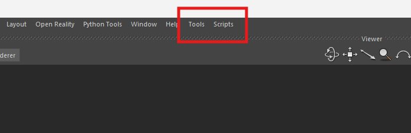
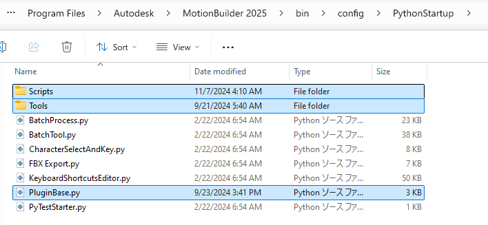

# Mobu-PluginBase-Python
Original Mobu Python Scripts for daily use

<br>

## Usage
  

Create `Tools` and `Scripts` Folder and stor `PluginBase.py` in the Python Startup Folder.

- `Tools`   : Folder for tools which will be stored in FBToolList
- `Scripts` : Folder for simple scritps
- `PluginBase.py` : Imported by Mobu System, then create Menu and associate scripts with it

<br>

The following image shows how to arrange them.




<br>

## Rules
### In the Tools
- The tool name must be identical to its module.
- Do not show tool, just create and add to FBToolList using `FBAddTool()`
<br>

## How it works
### Access to the Menubar
[pyfbsdk.FBGetmainWindow()](https://help.autodesk.com/cloudhelp/2025/ENU/MOBU-PYTHON-API-REF/namespacepyfbsdk.html#a168c7b3df16bd9358f8326cd57167134) returns the pointer to the MotionBuilder's Mainwindow.<br>
One of the child widget of the Mainwindow is that Menubar.


```python
def getMenubar() -> QMenuBar:
    # get Main Window
    pMainW = FBGetMainWindow()
    if pMainW:
        #Convert pointer to any non-inappropriate type
        MainW = wrapInstance(pMainW, QMainWindow)
        menubar = MainW.menuWidget().children()[1]
        return menubar
```
<br>

### Addition of Menu
`PluginBase.py` creates a Menu and associate scripts with it.<br>
Note that `QtGui.QAction.triggered()` has `checked` bool parameter.

```python
mbar  = getMenubar()
tmenu = mbar.addMenu("Tools")
smenu = mbar.addMenu("Scripts")

# if tools
for tools_filepath in tools_dir.iterdir():
    if str(tools_filepath).endswith(".py"):
        FBApplication().ExecuteScript(str(tools_filepath))
        
        # add submenu
        module_name = tools_filepath.stem
        t = tmenu.addAction(module_name)
        t.triggered.connect(lambda checked=False, name=module_name : ShowToolByName(name))

# if scripts
for script_filepath in scripts_dir.iterdir():
    if str(script_filepath).endswith(".py"):
        s = smenu.addAction(script_filepath.stem)
        s.triggered.connect(lambda checked=False, sp = str(script_filepath) : FBApplication().ExecuteScript(sp))

```
