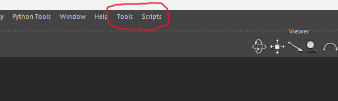

# Mobu-PluginBase-Python
Set the standard of arranging original Python Tools/Scripts

<br>

## Concepts
- Show up plugins in the tab menu from original distribution directory

    

- set two directory in `Users/<username>/Documents/MB/<version>/config/PythonStartup`

    - `Tools`   : Python Tools registered in FBTools
    - `Scripts` : Python Scripts which can be used as module
<br>

## Rules
### Scritps
- define `main()` to execute all functions in the module
- script name will be displayed in the menu 


### Tools
- In the main file, define `ActivateTool()` function below  

    ```
    def ActivateTool():
        # define the Tool name 
        toolName = "<tool name>"

        # check the Tool already created
        if toolName in FBToolList:
            ShowToolByName(toolName)
    
        else:
            # declare tool
            tool = <Original Tool Class declare>
            FBAddTool(tool)
            ShowToolByName(toolName)
    ```

- main script name will be displayed in the manu

<br>

## Mechanism to Add Tool

Module name will be extracted from Tools/Scripts path. 

    ``` python
        for file in os.listdir(<Tools/Scripts path>):
            if file.endswith(".py"):
                module_name = file[:-3]
                module = importlib.import_module(module_name)
                m = menu.addAction(module_name)

                # if Tools
                m.triggered.connect(module.ActivateTool())

                # if Scripts
                m.triggered.connect(module.main())
    ```

<br>