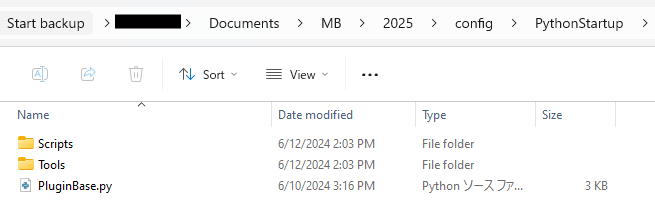

# Mobu-PluginBase-Python
Set the standard of arranging original Python Tools/Scripts

<br>

## Concepts
- Show up plugins in the tab menu from original distribution directory

    

    set two directory in `Users/<username>/Documents/MB/<version>/config/PythonStartup` folder

    - `Tools`   : Python Tools registered in FBTools
    - `Scripts` : Python Scripts which can be used as module

<br>

## Usage of Example
Put data under `src` folder  into `C:/Users/<username>/Documents/MB/<version>/config/PythonStartup` directory



<br>

## Rules
### In the Scripts
 define `main()` function to execute all functions in the module


### In the Tools
In the main file, define `ActivateTool()` function below  

```python
def ActivateTool():
    # define the Tool name 
    toolName = "<tool name>"

    # check the Tool already created
    if toolName in FBToolList:
        ShowToolByName(toolName)

    else:
        # declare tool
        tool = <Original Tool Class declare>
        FBAddTool(tool)
        ShowToolByName(toolName)
```


<br>

## Mechanism
### Get Access to MenuBar
[pyfbsdk.FBGetmainWindow()](https://help.autodesk.com/cloudhelp/2025/ENU/MOBU-PYTHON-API-REF/namespacepyfbsdk.html#a168c7b3df16bd9358f8326cd57167134) can return the MotionBuilder main window.<br>
One of the child widget contains MenuBar, to which add new menu.


```python
def getMenubar() -> QMenuBar:
    # get Main Window
    pMainW = FBGetMainWindow()
    if pMainW:
        #Convert pointer to any non-inappropriate type
        MainW = wrapInstance(pMainW, QMainWindow)
        menubar = MainW.menuWidget().children()[1]
        return menubar
```


### Add Menu
`PluginBase.py` extracts module name from Tools/Scripts path.  

```python
mbar  = getMenubar()
tmenu = mbar.addMenu("Tools")
smenu = mbar.addMenu("Scripts")

# if Tools
for file in os.listdir(<toolpath>):
    if file.endswith(".py"):
        # extract module name to import
        module_name = file[:-3]
        module = importlib.import_module(module_name)
        
        # add action to invoke tool function
        t = tmenu.addAction(module_name)
        t.triggered.connect(module.ActivateTool)

# if Scripts
for file in os.listdir(<scriptpath>):
    if file.endswith(".py"):
        # extract module name to import
        module_name = file[:-3]
        module = importlib.import_module(module_name)

        # add action to invoke tool function
        s = smenu.addAction(module_name)
        s.triggered.connect(module.main)
```

<br>